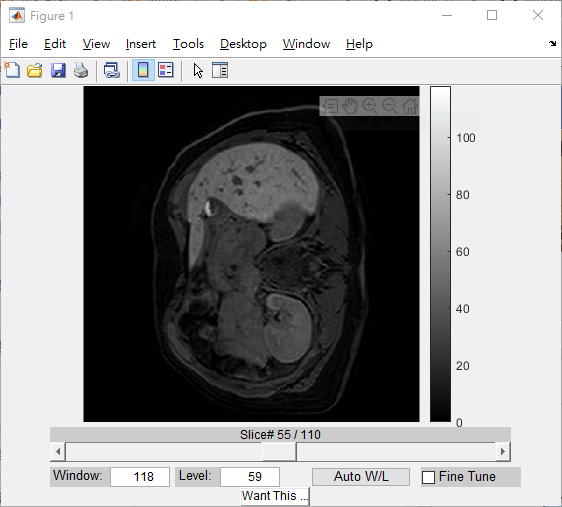

# Classifying Liver Fibrosis Stage Using Gadoxetic Acid-Enhanced MR Images

## This project is my master thesis done at [Linköping University, Sweden](https://liu.se/en).
## The paper is in collaboration with [CMIV](https://liu.se/en/research/center-for-medical-image-science-and-visualization-cmiv) and Linköping University Hospital.
## Main coding language used in this thesis:
## <font color=#FF4500>&emsp;&emsp;Matlab</font>
## <font color=#FF4500>&emsp;&emsp;Python - Pytorch/Sklearn</font>
## Main deep learning models used in this thesis:
## <font color=#FF4500>&emsp;&emsp;InceptionV3</font>
## <font color=#FF4500>&emsp;&emsp;Resnet</font>

### &emsp;&emsp;The goal of this thesis is trying to classify the liver fibrosis stage using only the MR image which collected by the staff in the hospital. The data sets I got is raw MR images. The label I got is the **_fibrosis stages_** of each patient and the **_liver segmentation data_** of every slice of each patient. The details of the entire procedure and results can be referred to the [paper](https://github.com/eugeneALU/Master-Thesis/blob/master/Document/Classifying%20Liver%20Fibrosis%20Stage%20Using%20Gadoxetic%20Acid-Enhanced%20MR%20Images.pdf) and the [final presentation](https://github.com/eugeneALU/Master-Thesis/blob/master/Document/Presentation.pptx). The following will be an introduction to the code I used.

# Code Introduction
## Matlab
* Matlab Tool box to access the MR images
    * readData <font color="Red">*[deprecated]*</font>
    * ReadData3D
    * MedicalImageProcessingToolbox
#### &emsp;Before running the Matlab code, the above Tool boxes needed to be include (I have typed in some code, but in case I forgot in some files)
```Matlab
addpath(genpath('../MedicalImageProcessingToolbox'));
addpath(genpath('../ReadData3D'));
```

* Matlab sample files to access the LiverMask(*.vtk*) and LiveImage(*.mhd*)
    * readMhdAndVtkExample.m
        * **read_mhd**
        * **vtk_read_header**
        * **vtk_read_volume**

        #### These three functions are the core functions to access the data. The image and segmentation data is separate, so if the masked liver image is desired, the user needs to *apply* the mask on the raw image as following: 
        ```Matlab
        MaskedImage = LiverImage;
        MaskedImage(~LiverMask) = 0;
        ```

    * imshow3D.m

        #### This is a function that generate a UI for user to examine the data(with or without liver, depend on the user)

        

* Core application files
    * Data checking files

        #### Since the data set is not complete, data (include raw image, segmentation and lable of fibrosis stage) of some patients is gone, we need to check the data before running the whole procedure. 
        * CheckDataLose.m
        * CheckMask.m
        * Checkxlsx.m

    * Feature extraction files
        * GLCM.m
        * CLRLM.m -- zigzag.m

        ####  The usage and reason why I use zigzag.m are mentioned in the [final presentation](https://github.com/eugeneALU/Master-Thesis/blob/master/Document/Presentation.pptx) and the code is actually from the online resource contain in directory-**TEST_GLRLM**.
        Directory-**TEST_GLRLM**/**TEST_GLCM** contains the online resource that also implements CLGM/CLRLM. The reason why I implement again is that it will be easier for me to track the code and add new features.

    * Integration files
        * Version_1.m <font color="Red">*[deprecated]*</font>
        * Main_2.m -- Version_2.m
        * Main_3.m -- Version_3.m
        * Main_HIFI.m -- Version_HIFI.m

        #### Version_2 and Version_3 are the same. The difference between them is which slice is taken into account when extracting the features. In Version_2.m, only one slice (whether set by the user or the slice contains the biggest liver area which is counted by the code) from each patient is taking into account. In Version_3.m, every slice from each patient is taking into account due to the lack of the data.
        #### Main_HIFI/Version_HIFI are used in HIFI data set which is used to test the model generalizability.

    * Helper
        * CreateDir.m <font color="Red">*[deprecated]*</font>
        * run.m -- integrate two Main files
        * SaveImage.m -- save images which will be used in Deep learning methods
        * ChangeFilename.m
        * GetImage.m -- get image of certain slice of certain patient

## Python
* Conventional machine learning (in Directory - **_other_model_**)
    * Model
        * Adaboost.py
        * ANN.py / ANN_selfimplement.py (self implement version, the function is the same)
        * K_means.py
        * LogisticRegression.py
        * Randomforest.py
        * SVM.py
    * Helper
        * Combine.py -- Create CSV files for the data and the corresponding label
        * CrossValidate.py -- Cross validation of different models
        * Feature_Correlation.py -- Mean and standard deviation of each feature 
        * GeneralTest.py -- Test the generalizability of the chosen models
        * GridSearch.py -- Grid search for the best parameters of the chosen models
        * NLE.py -- **baseline method of this thesis, which do not depend on any machine learning model**
        * PCA.py -- Principle Component Analysis(PCA) of all the extracted features
        * Plot.py -- Plot the distribution of whole the features which is compressed into three dimension after PCA
        * New_RFI.py -- New RFI formula we received after sent a mail to the author (See Appendix C in the [paper](https://github.com/eugeneALU/Master-Thesis/blob/master/Document/Classifying%20Liver%20Fibrosis%20Stage%20Using%20Gadoxetic%20Acid-Enhanced%20MR%20Images.pdf))
* Deep learning
    * Model
        * Inception_V3.py -- InceptionV3 architecture with three channels input images (still gray-scale but just duplicate into three channels)
        * Resnet_depthwise -- Resnet architecture with depthwise convolution
        * Resnet_onechannel.py -- Resnet architecture with one channel input images
        * Resnet_pretrain.py -- Resnet architecture with pretrain parameters
        * Resnet.py -- Resnet architecture with three channels input images (still gray-scale but just duplicate into three channels)
        * ShallowCNN.py -- Simple architecture with a few convolution layers
        * Xception.py <font color="Red">*[deprecated]*</font>
        * Train/Test_Inception/_ResXcep --Main training and testing files
        * Train_ShallowCNN -- Training shallowCNN(just used to familiarize with Pytorch and find the bug in data set during the period when all the other models are not working)
    * Helper
        * AugImage.py <font color="Red">*[deprecated]*</font>
        * CreateLabelFile.py 
        * dataset.py -- create Pytorch dataset object; Image augmentation is done in this file randomly
        * ReadResult.py -- Read the logged result using Tensorboard
        * SplitTrainValid.py -- Split training set into training and validation set

    * Not complete (For Siamesis Network)
        * CreatePairLabelFIle.py
        * Pairdataset.py
        * PairLoss.py
        * PlotDistance.py
        * Test/Train_Siamese.py

### If there is something missing you can contact me!!!


